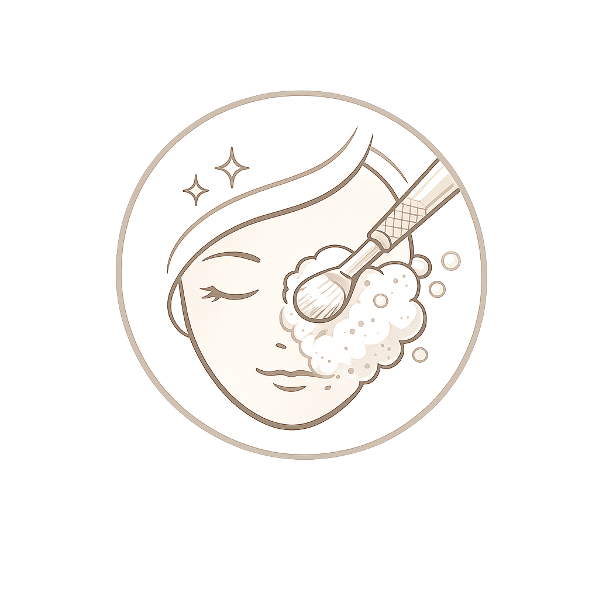

# Your Skin Clinic – BYGG-SPEC (facit)

**Gyllene regeln:** `akne.html` är mallen. Varje problem- och behandlingssida kopierar
dess exakta struktur och klassnamn. Inga egna layouter, inga påhittade klasser. Är något
oklart – verifiera i den riktiga filen, gissa aldrig.

---

## 1. `<head>` – länka ALLTID alla tre CSS-filer, i denna ordning
```html
<link rel="stylesheet" href="style.css">
<link rel="stylesheet" href="treatment.css">
<link rel="stylesheet" href="problem.css">
```
Saknas `problem.css` renderas behandlingskorten, FAQ och info-notiser ostylade.

---

## 2. Sektionsordning (hela sidan)
| # | Sektion | Klass | Per sida |
|---|---------|-------|----------|
| 1 | Header | `.header` | **Kopiera verbatim från akne.html** |
| 2 | Mobilmeny | `.mobile-nav` | **Kopiera verbatim** |
| 3 | Hero | `.tx-hero` | Byt bild, breadcrumb, h1, sub |
| 4 | Trust bar | `.trust-bar.trust-bar--compact` | **Kopiera verbatim** (4 items) |
| 5 | Intro | `.problem-intro` | "Vad är X?" + 2–3 stycken |
| 6 | Typer *(endast problem-sidor)* | `.problem-types` | `.type-card` med bild + text |
| 7 | Behandlingar | `.tx-cards-section` | `.behandling-kategori`-block med kort |
| 8 | FAQ | `.problem-faq#faq` | 3 flikar + 3 innehållsblock |
| 9 | Omdömen | `.reviews` | `.reviews-dual` Google + Bokadirekt |
| 10 | CTA | `.problem-cta` | h2 + p + 2 knappar |
| 11 | Footer | `.footer#kontakt` | **Kopiera verbatim** |
| 12 | Modaler | `.modal#modal-...` | En per behandling med varianter/tillval |
| 13 | Script | `<script src="script.js"></script>` | Sist i `<body>` |

Behandlingssidor (microneedling, kemisk-peeling, ansiktsbehandlingar …) = samma ordning,
men **utan** sektion 6 (Typer), och breadcrumb = `← Alla behandlingar`.

---

## 3. Hero (`.tx-hero`)
```html
<section class="tx-hero">
  <div class="tx-hero-bg">
    
  </div>
  <div class="tx-hero-overlay"></div>
  <div class="container">
    <div class="tx-hero-content fade-in">
      <a href="index.html#hudproblem" class="tx-breadcrumb">← Alla hudproblem</a>  <!-- behandlingssida: "← Alla behandlingar" -->
      <h1>[Rubrik]</h1>
      <p>[Underrubrik]</p>
      <div class="tx-hero-btns">
        <a href="https://www.bokadirekt.se/places/your-skin-clinic-48263" target="_blank" rel="noopener" class="btn btn-white">Boka tid</a>
        <a href="https://www.bokadirekt.se/boka-tjanst/your-skin-clinic-48263/konsultation-hud-laser-harborttagning-2170427" target="_blank" rel="noopener" class="btn btn-outline-white">Boka konsultation</a>
      </div>
    </div>
  </div>
</section>
```

## 4. Trust bar – kopiera verbatim
`.trust-bar.trust-bar--compact` med exakt 4 `.trust-item`: 4,9 av 5 (stjärnor),
600+ verifierade kunder, Certifierad specialist, Gallerian Stockholm (med Maps-länk).

## 5. Intro (`.problem-intro`)
```html
<section class="problem-intro">
  <div class="container">
    <div class="problem-intro__content fade-in">
      <h2>Vad är [X]?</h2>
      <p>…</p>
    </div>
  </div>
</section>
```

## 6. Typer (endast problem-sidor) – `.problem-types`
`.section-header` (`.section-label` + `.section-title`) + `.types-details.stagger` med
`.type-card.fade-in` → `.type-card__img` (img) + `.type-card__body` (h3 + p).

---

## 7. Behandlingar (`.tx-cards-section`) – HJÄRTAT

```html
<section class="tx-cards-section">
  <div class="container">
    <div class="section-header fade-in">
      <span class="section-label">Behandlingar</span>
      <h2 class="section-title">Behandlingar vi rekommenderar</h2>
    </div>

    <div class="behandling-kategori">
      <h2 class="behandling-kategori__title">[Kategorinamn]</h2>
      <p class="behandling-kategori__intro">[valfri intro]</p>
      <div class="info-notis"><p><strong>Viktigt att veta:</strong> …</p></div> <!-- valfritt -->

      <div class="behandling-cards-list">
        <!-- KORT här -->
      </div>
    </div>
  </div>
</section>
```
Gruppera behandlingar i `.behandling-kategori`-block (t.ex. "Ansiktsbehandlingar",
"Kemisk peeling", "Microneedling"). Underrubrik inom en kategori (t.ex. "För ryggen")
görs med en `<h3>` i Playfair.

### 7a. Behandlingskort – `.behandling-card-vertical` (DEN ENDA korttypen)
**Direktbokning (en tjänst):**
```html
<a href="https://www.bokadirekt.se/[boka-tjanst-eller-places-länk]" target="_blank" rel="noopener" class="behandling-card-vertical fade-in">
  
  <div class="behandling-card-vertical__content">
    <div class="behandling-card-vertical__header">
      <h3>[Titel]</h3>
      <div class="behandling-card-vertical__meta">
        <span>[X] min</span>
        <span class="price">[Y] kr</span>
      </div>
      <p class="behandling-card-vertical__description">[Kort, kund-vänlig text – ingen jargong]</p>
    </div>
    <div class="moment-icons">
      <div class="moment-icon"><span>Rengöring</span></div>
      <!-- fler steg -->
    </div>
  </div>
  <div class="behandling-card-vertical__arrow">→</div>
</a>
```
**Med varianter/områden/tillval (öppnar modal):** byt `<a>`-starten mot
`<a href="#" data-modal="modal-[id]" class="behandling-card-vertical fade-in">` (ingen target/rel).

**Tillval/markörer (valfria, inuti `<a>`):**
- Mest bokad-bricka: `<div class="behandling-card-vertical__badge">Mest bokad</div>`
- Stjärnor (efter `<h3>`, före meta): `<div class="behandling-card-vertical__stars">★★★★★</div>`

**Regler:**
- En tjänst utan val → kortet länkar **direkt** till Bokadirekt (`target="_blank" rel="noopener"`).
- Flera längder/områden/tillval → kortet öppnar en **modal** (`href="#" data-modal="…"`).
- Saknas bild ännu → `<div class="behandling-card-vertical__image behandling-card-vertical__image--placeholder">Bild kommer här</div>`.

### 7b. Steg-ikoner (`.moment-icons`)
Rad med `.moment-icon` = ` + <span>[etikett]</span>`. 5–6 steg per kort.
Ikonfiler i `images/` (verifiera att filen finns innan du använder den):
- Bas (bindestreck): `icon-cleanse`, `icon-exfoliate`, `icon-extraction` (needling/portömning/nano),
  `icon-highfrequency`, `icon-mask`, `icon-massage`, `icon-serum`, `icon-spf`, `icon-antibacterial` (desinfektion)
- Special (utan bindestreck): `iconbiocellulose.png` (bio-cellulose/sheet mask), `iconredlight.png`
  (LED/IR/rödljus), `biorepeelikon.png` (BioRePeel), `icemaskicon.png` (ice mask), `prxt33icon.png` (PRX)
- Samma ikon får återanvändas med olika etikett (t.ex. `icon-mask` → "Lugnande mask"/"Återfuktande mask").

---

## 8. Modal (`.modal`) – för varianter/tillval
```html
<div class="modal" id="modal-[id]" role="dialog" aria-modal="true" aria-labelledby="modal-[id]-title" hidden>
  <div class="modal__backdrop" data-modal-close></div>
  <div class="modal__content">
    <button class="modal__close" data-modal-close aria-label="Stäng">✕</button>
    <h2 class="modal__title" id="modal-[id]-title">[Titel] — välj område/alternativ</h2>
    <p class="modal__subtitle">Klicka på det du vill boka.</p>
    <div class="modal__options">
      <a href="[bokadirekt-länk]" target="_blank" rel="noopener" class="modal__option">
        <div class="modal__option-info">
          <h3>[Variant]</h3>
          <span class="modal__option-meta">[X] min · [Y] kr</span>
          <!-- valfri tillvalstext: -->
          <span class="modal__option-note">
            <strong class="modal__note-intro">Lägg till för bättre resultat:</strong>
            <span class="modal__bullet">[Tillval] <em>([tid], [pris])</em> — [nytta].</span>
          </span>
        </div>
        <span class="modal__option-arrow">→</span>
      </a>
    </div>
    <button class="modal__back-btn" data-modal-close>Tillbaka</button>
  </div>
</div>
```
Modaler placeras längst ned i `<body>`, före `<script>`. `script.js` fångar `[data-modal]`.
Länktyper: `/boka-tjanst/…-[id]` = direktbokning · `/places/…?ss=[id]` = tjänstevy (tillval i nästa steg).

---

## 9. FAQ (`.problem-faq`)
3 flikar (`.faq-tabs` > `.faq-tab`, första `.faq-tab--active`, varje med `data-category`,
ikon-svg + `<span>`) + 3 innehållsblock (`.faq-list.faq-content`, första `.faq-content--active`,
matchande `data-category`). Varje fråga = `.faq-item` > `.faq-question` (button, `aria-expanded`,
text + chevron-svg) + `.faq-answer` > `<p>`. `script.js` sköter flikar + dragspel.
Standardkategorier: **Behandling · [Ämne] i allmänhet · Hudvård & resultat**.

## 10. Omdömen (`.reviews`)
`.section-header` + `.reviews-dual` med två `.reviews-panel`:
- **Google** (logo-svg, "5,0 / 5") och **Bokadirekt** ("4,9 · 590+ omdömen").
- Varje panel: `.reviews-panel-header` + `.reviews-panel-cards` med `.review-card`
  (`.review-card-stars`, `<p>` citat, `.review-author`, `.review-source`).
- Visa 3 kort + extra med attributet `hidden`, sedan `.reviews-panel-toggle` ("Visa fler")
  + en "Se alla …-omdömen"-länk.
Omdömen är per sida (Isabella ger texterna, eller återanvänd relevanta).

## 11. CTA (`.problem-cta`)
Forest green-bakgrund, vit text. `.problem-cta__content.fade-in`: h2 + p + `.problem-cta__btns`
(`btn btn-primary` "Boka tid" + `btn btn-outline` "Boka konsultation").

## 12. Footer – kopiera verbatim från akne.html.

---

## 13. REGLER (gäller alltid)
1. **Endast ordinarie priser** – aldrig kampanjpriser.
2. **All medicinsk text ska vara korrekt** – inget påhitt. Saknas underlag: fråga.
3. **Verifiera riktiga filnamn/klassnamn** i repot före varje ändring – gissa aldrig.
4. **Bygg inkrementellt och verifiera** varje steg. Aldrig en stor "big-bang"-omskrivning
   av en fungerande sida.
5. **Kopiera header, mobilmeny och footer verbatim** från akne.html – skriv inte om dem.
6. **Bilder och SEO görs sist** (polish-fas).
7. Korten = `.behandling-card-vertical` (aldrig `.tx-card`-accordions med
   Tillval/Passar/Resultat/Ej lämplig).

---

## 14. Vad jag behöver av dig per ny behandling (checklista)
- [ ] Sidans namn + hero-bild + breadcrumb-typ (problem/behandling)
- [ ] Intro-text ("Vad är X?")
- [ ] *(problem-sida)* Typerna (rubrik + kort text + ev. bilder)
- [ ] Behandlingslista, grupperad i kategorier: **namn · tid · ordinarie pris · Bokadirekt-länk**
- [ ] Protokoll per behandling → så jag kan sätta rätt steg-ikoner
- [ ] Vilka kort som har varianter/tillval (→ modal) + deras länkar
- [ ] FAQ: 3 kategorier med frågor & svar
- [ ] Omdömen (eller "återanvänd")
